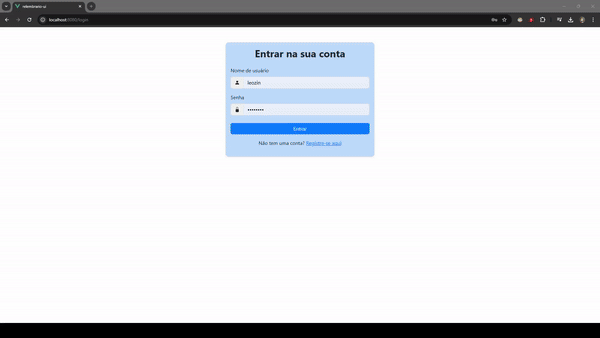

# Welcome to Relembrário

## Demo



Relembrário is a project developed in collaboration with the Universidade do Sagrado Coração in Bauru-SP (Unisagrado) by a group of four students. It serves as a comprehensive repository of memories—a space where users can document all the significant moments of their lives, including photos, descriptions, dates, and more.

This README provides detailed instructions for setting up the development environment for both the back-end and front-end using WSL (Windows Subsystem for Linux).

---

## Pre-requisites

Before starting, ensure you have the following installed:
- Windows Subsystem for Linux (WSL)
- Python 3.12.2 min (No WSL)
- Git (No WSL)
- Node.js (No WSL)
- npm (No WSL)

---

## Installation Guide

### 1. Install WSL
Open PowerShell as an administrator and run:
```bash
wsl --install
```

### 2. Set up the project directory
Access WSL and create a folder for your projects:
```bash
mkdir projects
cd projects
```

### 3. Clone the repository
Clone the public project repository from GitHub:
```bash
git clone https://github.com/LeonardoVDN/Relembrario.git
cd Relembrario
```

### 4. Set up a virtual environment
Create and activate a virtual environment:
```bash
python -m venv venv
source venv/bin/activate  # For Linux/Mac
source venv/Scripts/activate  # For Windows
```

### 5. Prepare the environment
Update the system and install necessary dependencies:
```bash
sudo apt update
sudo apt install -y build-essential gcc python3-dev libdbus-1-dev libglib2.0-dev
```

### 6. Install Python dependencies
Install project dependencies:
```bash
pip install -r requirements.txt
```

### 7. Configure environment variables
Create a `.env` file in the `Relembrario` directory with the following content:
```plaintext
SECRET_KEY=Your-key
DEBUG=True
ALLOWED_HOSTS=localhost,127.0.0.1
DATABASE_URL=sqlite:///db.sqlite3
```

#### Generate a random secret key
Run the following Python script to generate a secure key:
```python
python

from django.core.management.utils import get_random_secret_key
print(get_random_secret_key())
```
You will see an output similar to this:
```bash
a1b2c3d4e5f6g7h8i9j0k1l2m3n4o5p6q7r8s9t0u1v2w3x4y5z6
```
Replace `Your-key` in the `.env` file with the generated key.

### 8. Create a superuser
Run the following command to create a Django superuser, to simplify access to the project and skip the registration step through the registration screen, let's create a superuser that will be used to access the Django admin panel and perform the first login to the project.:
```bash
python manage.py createsuperuser
```
- Press **Enter** to accept the default username.
- Set and confirm the password. If prompted to bypass password validation, type `Y` and press **Enter**.
- If you see the following message, it indicates the password chosen is too basic. Type Y and press Enter to bypass the password validation:
```bash
Bypass password validation and create user anyway? [y/N]: y
```
- Once the superuser is successfully created, you will see this message:
```bash
Superuser created successfully.
```

Use the username and password you set to log in to the project's main screen. Additionally, you can access the Django admin panel by appending /admin/ to the backend URL.

### 9. Apply migrations and start the server
Run the following commands to initialize the database and start the backend server:
```bash
python manage.py migrate
python manage.py runserver
```

Access the project backend at `http://127.0.0.1:8000/`.

---

## Frontend Configuration

**In a new terminal window, navigate to the project folder and activate the previously created virtual environment:**

### 1. Access the frontend directory
Open a new terminal, activate the virtual environment, and navigate to the frontend folder:
```bash
cd project/Relembrario/relembrario-ui/
```

### 2. Install Node.js and npm
Install Node.js:
```bash
sudo apt install nodejs
```

Install npm:
```bash
sudo apt update
sudo apt install npm
```

### 3. Install frontend dependencies
Run the following command to install necessary packages:
```bash
npm install
```

### 4. Start the frontend server
Run the frontend server with:
```bash
npm run serve
```

Click the generated link to access the frontend.

---

## Usage

- Use the Django superuser credentials to log in to the admin panel at `http://127.0.0.1:8000/admin/`.
- Start exploring the project functionality on the main interface.

---

## Troubleshooting

If you encounter any issues, verify the following:
- All dependencies are installed correctly.
- The virtual environment is activated when running Python or Django commands.
- Use the appropriate command for activating the virtual environment based on your OS.

---

## Contributing

We welcome contributions to improve this project. Please fork the repository and submit a pull request with your changes.

---

## Developers

We are grateful for the efforts and collaboration of the following contributors who helped bring this project to life:

- **[Leonardo Valentim](https://github.com/LeonardoVDN)**: Project Lead and Full-Stack Developer  
- **[Udymilla Chagas](https://github.com/Udymilla)**: Frontend Developer  
- **[Ana Beatriz]**: UI/UX Designer  
- **[Natasha](https://github.com/NatashaNTS)**: Documentation and QA  
---

## Contact Information

For questions, suggestions, or collaboration opportunities, feel free to reach out to us:

- **Email:** [Leonardo Email](mailto:leonardovn599@gmail.com)
- **GitHub Issues:** Submit your queries or report bugs via the [Issues section](https://github.com/LeonardoVDN/Relembrario/issues).
- **LinkedIn:** [Leonardo Valentim](https://www.linkedin.com/in/leovalentimnascimento/)

We appreciate your interest and support in our project!